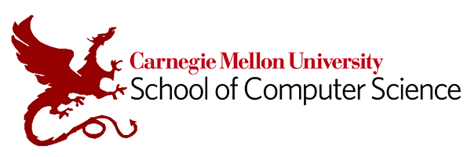

## Rubrik  
*Software Engineering Intern*  
*Jun 2024 – Aug 2024*

I was responsible for **redesigning Rubrik’s database service architecture**, which tracks over **6000** customer database instances on GCP clusters. One of the key contributions was creating a **new database key-value store** within the database service to replace Rubrik’s current subscription to a third-party service, Consul. This resulted in **cost savings of over $8000 per year**. Additionally, I redesigned the key-value store interface and improved the backup and recovery process through GCP buckets.

## Carnegie Mellon University
*Research Intern*  
*Jan 2024 - Aug 2024*

Worked with Professor [Roger B. Dannenberg](https://www.cs.cmu.edu/~rbd/) on the [Serpent programming language](https://www.cs.cmu.edu/~music/cmp/serpent/doc/serpent.htm), [a faster version of Python](https://www.cs.cmu.edu/~rbd/blog/fast/fast-blog10jan2024.html) (can be downloaded [here](https://sourceforge.net/projects/serpent/)). Inspired by Python, Serpent has a simple, minimal syntax, dynamic typing, and support for object-oriented programming. Serpent is designed for use in real-time systems, especially interactive multimedia systems. It 
provides a real-time parallel mark-sweep garbage collector and multiple virtual machines (multiple independent instances of Serpent can run concurrently in one address space).

I **led Serpent's benchmarking team**. We wrote standard benchmarking algorithms, such as: matrix multiplcation, binary-tree searches, n-queen solving, and sudoku. We took practical runtime measurements to evaluate the performance of simple algorithms like sorting, searching, and mathematical computations. The tests were designed to measure both execution speed and memory usage across a variety of scenarios. We also implemented each algorithm in Serpent, Python, C, and C++ to directly compare their runtime performance in similar conditions, using standard libraries and common optimizations for each language.

Click [here](https://github.com/rbdannenberg/cserpent) to access the project GitHub repository.

## Carnegie Mellon University
*Research Intern*  
*May 2023 - Dec 2023*

I worked with [Professor David Touretzky](https://www.cs.cmu.edu/~dst/) on an **NSF, Google, and Amazon funded research project**, developing an interactive knowledge‐graph web application on SPARQL. The goal of the project was to develop a set of **generic reusable tools for creating and navigating knowledge graphs**. These tools were designed to be flexible and adaptable to a wide variety of data types, enabling users to visualize and explore relationships in dynamic knowledge graph structures. In building these tools, I leveraged several technologies, including **JavaScript**, **Bootstrap**, and **Cytoscape**.

We presented our [research poster](../files/2023 Knowledge Graph Poster.pdf) at the AI‐CARING (AI Institute for Collaborative Assistance and Responsive Interaction for Networked Groups) conference in Aug 2023.

Click [here](https://github.com/touretzkyds/KnowledgeGraphDemo/tree/devel) to access the project GitHub repository.