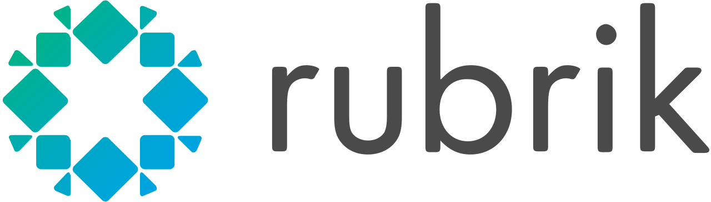

## Rubrik  
*Software Engineering Intern*
*Jun 2024 – Aug 2024*

I was responsible for redesigning Rubrik’s database service architecture, which tracks over 6000 customer database instances on GCP clusters. One of the key contributions was creating a new database key-value store within the database service to replace Rubrik’s current subscription to a third-party service, Consul. This resulted in cost savings of over $8000 per year. Additionally, I redesigned the key-value store interface and improved the backup and recovery process through GCP buckets.

  
  
I was responsible for redesigning Rubrik’s database service architecture, which tracks over 6000 customer database instances on GCP clusters. One of the key contributions was creating a new database key-value store within the database service to replace Rubrik’s current subscription to a third-party service, Consul. This resulted in cost savings of over $8000 per year. Additionally, I redesigned the key-value store interface and improved the backup and recovery process through GCP buckets.

## Carnegie Mellon University
*Research Intern*
*Jan 2024 - Aug 2024*

  
  
Worked with Professor [Roger B. Dannenberg](https://www.cs.cmu.edu/~rbd/) on the [Serpent programming language](https://www.cs.cmu.edu/~music/cmp/serpent/doc/serpent.htm), [a faster version of Python](https://www.cs.cmu.edu/~rbd/blog/fast/fast-blog10jan2024.html) (can be downloaded [here](https://sourceforge.net/projects/serpent/)). Inspired by Python, Serpent has a simple, minimal syntax, dynamic typing, and support for object-oriented programming. Serpent is designed for use in real-time systems, especially interactive multimedia systems. It 
provides a real-time parallel mark-sweep garbage collector and multiple virtual machines (multiple independent instances of Serpent can run concurrently in one address space).

We compared all languages using standard benchmarking algorithms, such as: matrix multiplcation, binary-tree searches, n-queen solving, and sudoku. We took practical runtime measurements to evaluate the performance of simple algorithms like sorting, searching, and mathematical computations. The tests were designed to measure both execution speed and memory usage across a variety of scenarios. We also implemented each algorithm in Serpent, Python, C, and C++ to directly compare their runtime performance in similar conditions, using standard libraries and common optimizations for each language.
.

[here](http://gonzherme.github.io/files/vqa-paper.pdf)